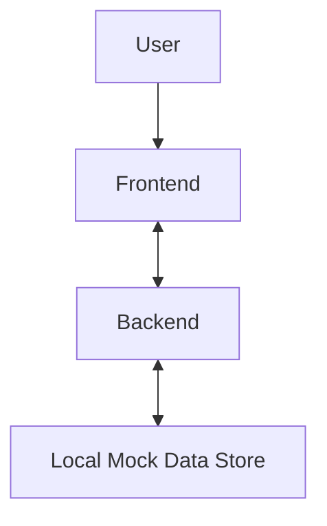

# ARCHITECTURE.md
## PoC #52: Search Ads Auction Simulator - High-Level Architecture

This document outlines the high-level architecture for the "Search Ads Auction Simulator" PoC, adhering to the Real Rails DNA and Execution Protocol. The system will comprise a Python FastAPI backend for data and simulation logic, and a Next.js frontend for interactive visualization and user interface.

### 1. Overall System Diagram

### 2. Frontend Application (Next.js)

*   **Framework:** Next.js 14+ (App Router)
*   **Language:** TypeScript
*   **Styling:** Tailwind CSS
*   **UI Components:** shadcn/ui (customized with Real Rails color palette)
*   **Visualization Libraries:** D3.js, Plotly, Apache ECharts, TanStack Table (for auction data display)
*   **Core Functionality:**
    *   Interactive dashboard displaying the search ads auction simulation.
    *   Dynamic bid sliders for user input.
    *   Visualization of rank logic, CPC outcomes, and margin impact.
    *   Integration with FastAPI backend for simulation data.
*   **Layout Protocol:**
    *   **Structure:** 2-Column Split.
    *   **Main Stage (70%):** High-performance interactive visualization/auction table.
    *   **Intelligence Sidebar (30%):**
        *   **Section A:** PoC Title ("Search Ads Auction Simulator") & High-level Metric.
        *   **Section B:** "Why This Matters" (Infrastructure context: "Explains why demand capture has its own hidden rails.").
        *   **Section C:** "Who Controls the Rail" (Governance/Institutional context: "The invisible hand of the platform's algorithms governs the search ad auction, setting the stage for advertisers to strategically contend for visibility through optimized bids and quality scores.").
        *   **Section D:** Functional Filters & Tooltips.
        *   **Section E:** Download Sample Data button.
*   **Visual Identity (Real Rails DNA Adherence):**
    *   **Theme:** High-end Fintech Terminal / Real-Time Intelligence Dashboard.
    *   **Color Palette:**
        *   **Background:** `#030712` (Obsidian Black)
        *   **Surface/Cards:** `#0B1117` (Deep Navy Grey)
        *   **Accent Primary:** `#38BDF8` (Electric Cyan)
        *   **Accent Secondary:** `#818CF8` (Indigo)
        *   **Borders:** `#1F2937` (Slate-800), 1px width.
    *   **Typography:** Inter or Geist Sans (Tight letter-spacing).
    *   **Style:** Subtle glassmorphism on cards; 0.5px cyan glow on active interactive elements.

### 3. Backend Application (FastAPI)

*   **Framework:** Python FastAPI
*   **Data Handling:** Pandas (for data orchestration, simulation logic, and transformation)
*   **Core Functionality:**
    *   Simulate keyword bidding, quality scores, CTR, and position economics.
    *   Generate synthetic mock data for keywords, bids, CTR, and quality scores.
    *   Implement rank logic, calculate CPC outcomes, and determine margin impact based on simulation parameters.
    *   Expose API endpoints to serve simulated auction data and results to the frontend.
*   **Data Sources:** Primarily synthetic data. World Bank Data is listed but for this PoC, mock data generation is emphasized.
*   **Virtual Environment:** A Python virtual environment (`venv`) will be used to manage dependencies.

### 4. Data Flow and Communication

*   The Next.js frontend will communicate with the FastAPI backend via RESTful API calls.
*   The backend will generate and provide the necessary data for the frontend's visualizations and interactive elements.
*   **Mock Fallback Guardrail:** The system must automatically switch to a local `mock_data.json` if the API encounters errors or rate limits, ensuring the UI remains functional for demos.

### 5. Security & Environment

*   **Environment Variables:** All sensitive information (e.g., API keys, if external APIs were to be integrated later) must be stored in `.env` files and accessed via environment variables. `.env` files will be ignored by Git.

### 6. Development Workflow

*   **Backend First:** Development will prioritize establishing the FastAPI schema and data simulation logic.
*   **UI Assembly:** The frontend UI will be built after the backend API is defined.
*   **Iterative:** The process will be iterative, focusing on functional simulation logic before refining UI/UX.

