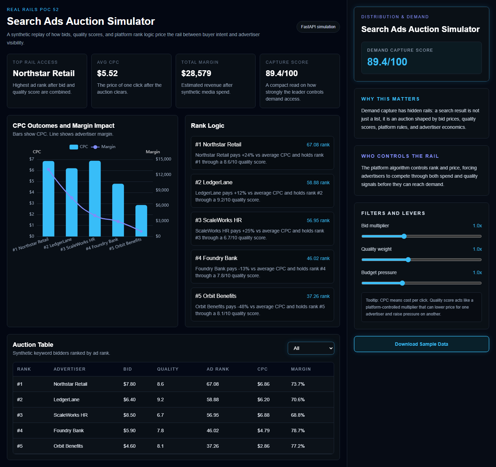
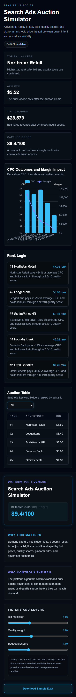
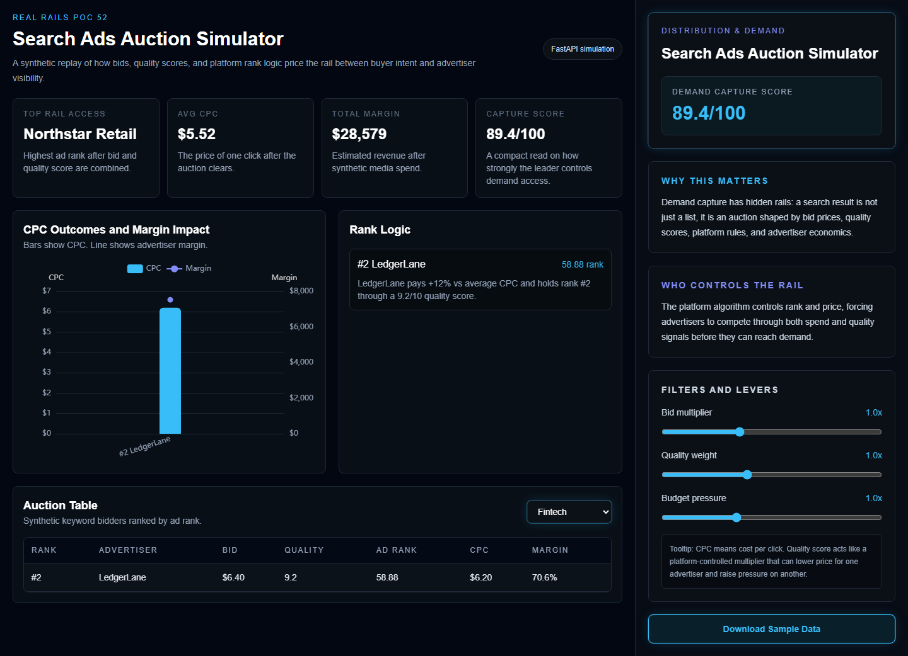

# PoC 52: Search Ads Auction Simulator

Search Ads Auction Simulator is a small intelligence dashboard for the **Distribution & Demand** rail. It explains how paid search turns buyer intent into a priced auction, where visibility depends on bid levels, quality scores, rank logic, and the economics behind each click.

The demo uses clearly labeled synthetic advertiser data. That keeps the project reproducible while still showing the mechanics that matter: who wins the position, what they pay, and whether the traffic is profitable after media spend. World Bank ingestion is intentionally out of scope for this PoC; no World Bank data is fetched or transformed by the application.

## What It Shows

- A simulated keyword auction with bids, quality scores, ad rank, CPC, clicks, revenue, and margin.
- Bid and market-pressure sliders that update the auction without a page refresh.
- A sector filter for narrowing the table and chart.
- An intelligence sidebar explaining why demand capture matters and who controls the rail.
- A downloadable sample dataset for review or reuse.
- Backend mock fallback data so the demo still runs if the API is unavailable.

## Architecture Summary

The Search Ads Auction Simulator follows a decoupled client-server architecture designed for high performance and reliability:

- **Frontend (Next.js 14):** A React-based SPA using the App Router. It manages state for auction parameters (bid, quality, budget) and triggers re-fetches to the backend. The UI is built with Tailwind CSS following the Real Rails design system (#030712 background, 70/30 split).
- **Backend (FastAPI):** A Python microservice that implements the auction logic. It calculates Ad Rank, CPC (Generalized Second-Price), and financial metrics (Revenue, Margin) using Pandas.
- **Data Orchestration:** The backend uses a "Simulation Engine" that transforms synthetic advertiser data into real-time insights. It includes a robust fallback mechanism that serves `mock_data.json` if the simulation logic or data sources fail.
- **Intelligence Layer:** Insights are generated server-side and rendered in the "Rank Logic" and "Intelligence Sidebar" components, explaining the "Why" and "Who" behind the Distribution & Demand rail.

## Validation

- **UAT Checklist:** See [UAT_CHECKLIST.md](./UAT_CHECKLIST.md) for functional verification.
- **VAR Report:** See [VAR_REPORT.md](./VAR_REPORT.md) for the Visualization Audit Review.

## Screenshots & Demo

### Desktop Dashboard


### Mobile View


### Interactive State


### Demo Video
[Search Ads Auction Simulator Demo](./20260601-1257-42.1147563.mp4)

## Backend

```bash
cd backend
python -m venv venv
venv\Scripts\activate
pip install -r requirements.txt
uvicorn app.main:app --reload
```

API endpoints:

- `GET /` returns project status.
- `GET /auction/simulate` returns the simulated auction table, sidebar copy, CPC curve, margin impact, and high-level metrics.
- `GET /auction/sample` returns the checked-in fallback payload.

Run backend tests:

```bash
cd backend
pytest
```

## Frontend

Node.js LTS is required for the frontend. These dependencies live in `frontend/node_modules/`, not in the Python virtual environment.

```bash
cd frontend
npm install
npm run dev
```

For a production-style local run:

```bash
cd frontend
npm run build
npm run start
```

By default the frontend calls `http://127.0.0.1:8000`. To point it somewhere else, set:

```bash
NEXT_PUBLIC_API_BASE_URL=http://127.0.0.1:8000
```

Validate the frontend:

```bash
cd frontend
npm run lint
npm run build
```

## Real Rails Constraints

- Background color: `#030712`.
- Desktop layout: 70% main stage and 30% intelligence sidebar.
- Sidebar includes the project metric, rail context, governance/control context, filters, tooltip copy, and sample data download.
- Search ad records are synthetic and labeled for public demo use.
